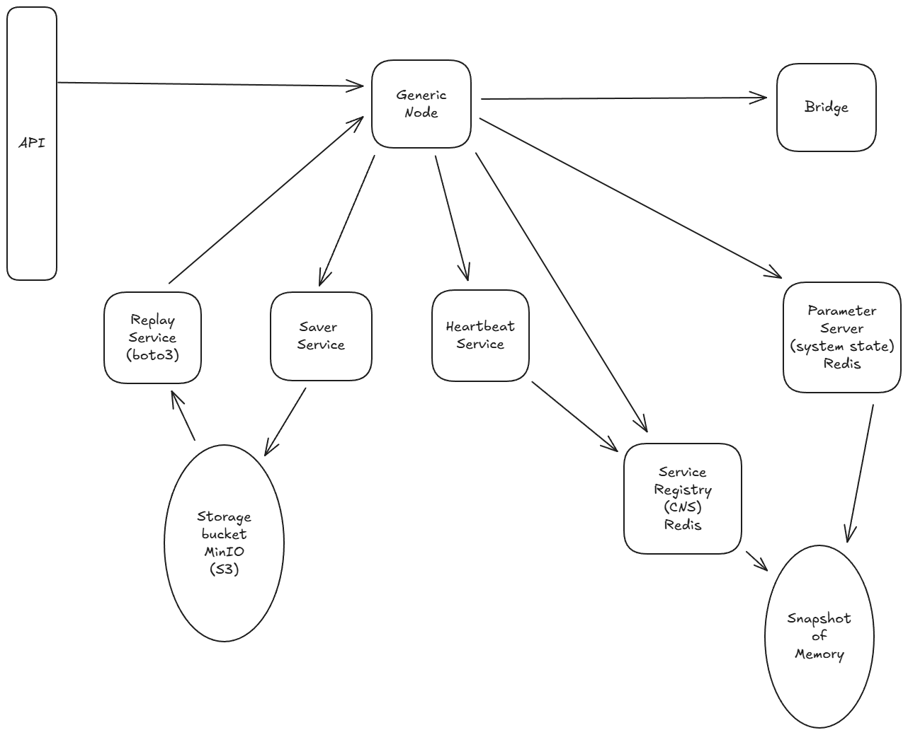

# CANDOR Research

*AKA "The Backend"*

### Goals

The goal of the Backend is to support:
1. <b>Development Speed</b>. It should be easy to add new sensors (hardware) and algorithms (software).
2. <b>Parallelization</b>. You should be able to speed things up by adding more of those things in parallel. 
3. <b>Flexibility</b>. Joshua asks for lots of crazy stuff. You should be able to add any of the crazy stuff he asks for without too much overhead.

### Contribution Principles

Core:
- Documentation must be up-to-date with the code.
- Installation must be up-to-date and deployable on a new PC.
- Primary branch `dev` must have been tested.

Auxiliary: 
- Any functionality added to the C++ codebase must also be added to the python codebase if the functionality should be shared.

### Architecture

To support these goals, the Backend is built on the ZeroMQ networking library. Networking lets us abstract system components into modular blocks, build in parallelization (multiple nodes, or multiple computers), and stay flexible by, in the worst case, only editing a node or two to add crazy new features.

The Backend is built on top of the <b>Generic Node</b> and the Central Name Server <b>(CNS)</b>. The generic node is an abstract base class that serves as a framework for every node in the system. Nodes can be anything that processes data (e.g., sensors, algorithms, visualizers, etc.). The <b>CNS</b> stores metadata that facilitates inter-node communication. All nodes must contact the <b>CNS</b> before they can being sending messages.

Nodes can be classified into one of the following types based on their role in the system:
- <b>`devices`</b> Physical devices.
- <b>`algorithms`</b> Processing algorithms.
- <b>`visualization`</b> Nodes for visualizing data.
- <b>`io`</b> Nodes for handling input/output.

### Design Principles 

Node design principles:
- Nodes must be able to startup and shutdown without killing other nodes.
- Nodes must be always alive (and start as system processes) (WIP Feature).

### Message Types

All Nodes must support the following types of communication.

Message Type | Networking | Topic Template | Usage
-|-|-|-
<b>data</b> | Pub/Sub | `/{nodetype}/{id}/{datatype}` | Real-time data
<b>heartbeat</b> | Pub/Sub | `/{nodetype}/{id}/heartbeat` | - 
<b>metrics</b> | Pub/Sub | `/{nodetype}/{id}/metrics` | - 
<b>event</b> | Pub/Sub | `/{nodetype}/{id}/event` | Notify that node parameter has changed (WIP Feature)
<b>api</b> | Req/Rep | `/{nodetype}/{id}/api` | Get/set node parameter
<b>command</b> | Req/Rep | `/{nodetype}/{id}/command` | Change node state

All real-time streaming data should be sent using <b>data</b> messages. The <b>heartbeat</b> and <b>metrics</b> messages should be handled within the <b>Generic Node</b>. Any change within one node that impacts another node should be transmitted using an <b>api</b> message. The <b>event</b> message, along with the parameter server, should at some point replace the api get/set methods. The <b>command</b> message should only be used for triggering a node `reset()`.

### Why do we...
- **Create Nodes as Services**. This was picked so that nodes are always on. If nodes can turn on and off then they need to notify other nodes what state they're in. This quickly gets messy when starting up many nodes at a time, especially long chains of nodes. Assuming nodes are always on simplifies the overall system complexity.
